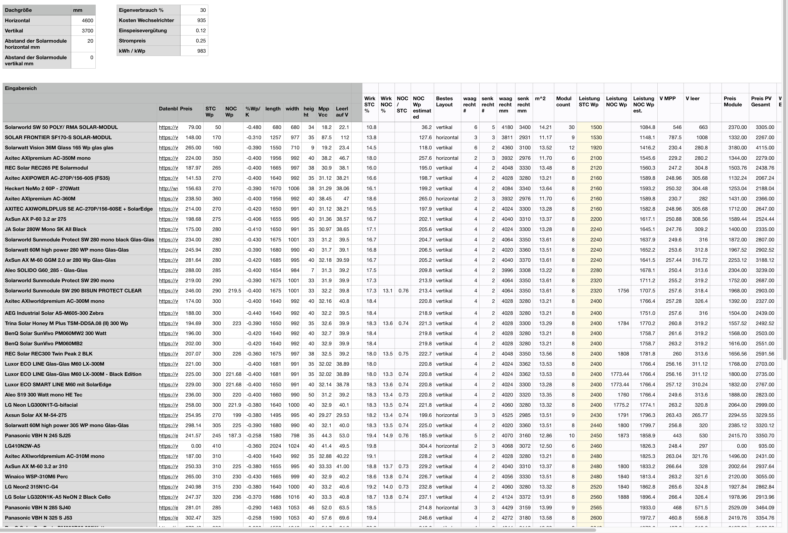

# Solarrechner

Da mein Dach recht klein ist, benötigte ich einen einfachen Solarrechner, damit man weiss wieviele Module bei einer bestimmten Dachgröße aufs Dach passen.

Das Original ist ein Numbers Dokument und man gibt einfach die Dachgröße und die Modulabstände (horizontal und vertikal) ein und das Sheet kann man dann nach der Spalte AH sortieren. Dann sieht man mit welcher Ausrichtung man wieviel Wp aufs Dach bekommt.

Die Module und Preise habe ich von den gängigen Seiten im deutschsprachigen Raum genommen und sind Stand Ende Mai 2018

 
